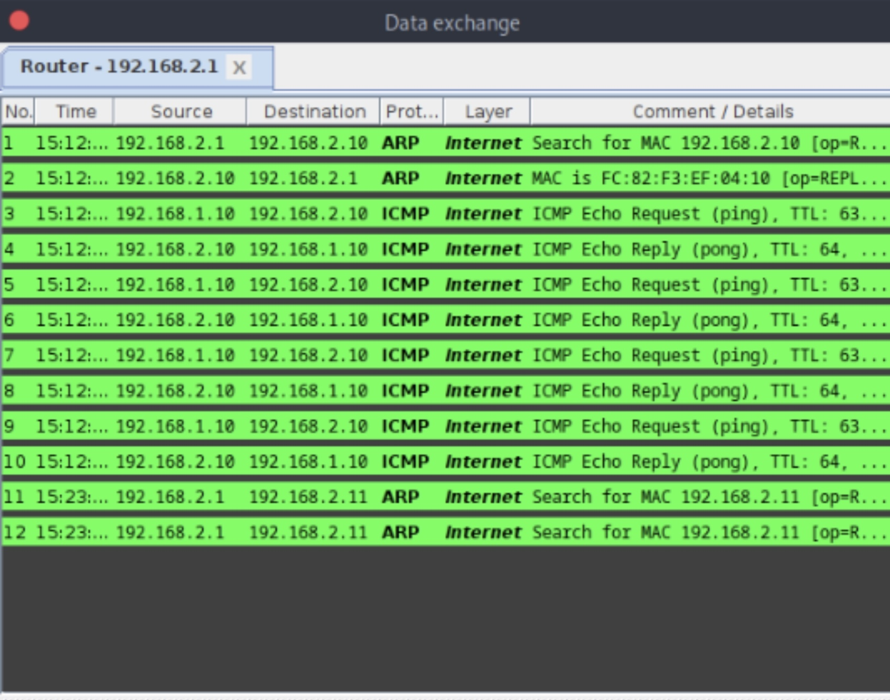
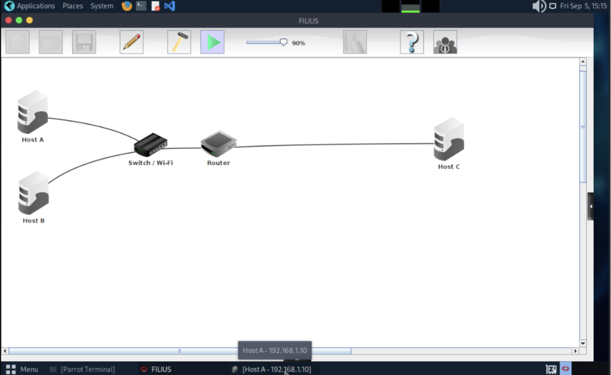
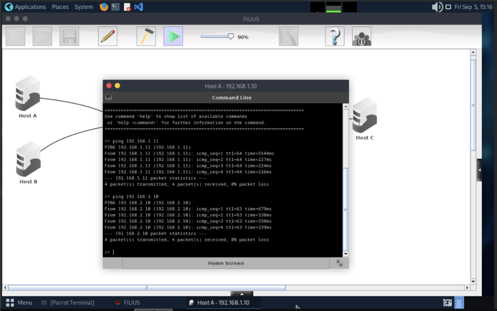
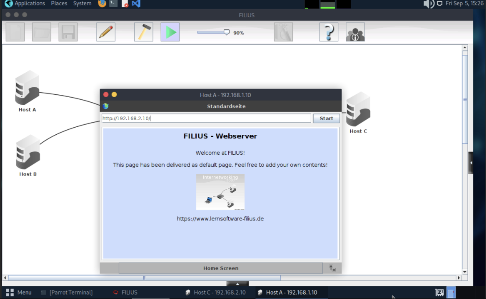

# Homework 2 – ARP, Default Gateway, and Packet Journey  
**Course:** CS 456 – Modern Cybersecurity  
**Repo:** modern-cybersecurity/homeworks/hw2  

---

## 📸 Network Lab Screenshots
- **Data exchange capture:**   
- **Network topology:**   
- **Ping results:**   
- **Web server test:**   

---

## 🧩 Concepts and Explanations  

### 🔹 The Role of ARP
- **Who sends the ARP request?**  
  Host A sends the ARP request when it needs to communicate for the first time.  

- **Who receives it?**  
  The ARP request is **broadcasted on the local subnet**. All devices on the LAN (via the switch) receive it, but only the device with the matching IP replies.  

- **What information is requested?**  
  Host A is asking: *“What is the MAC address for IP `192.168.1.11`?”*  

- **Local subnet case (Host A → Host B):**  
  Host B replies with its MAC address. Host A stores this mapping in its ARP cache for future communication.  

- **Remote subnet case (Host A → Host C):**  
  Host A does **not** ARP Host C directly. Instead, it ARPs for the **router’s MAC address** (its default gateway). The router is then responsible for finding Host C’s MAC on the other subnet.  

---

### 🔹 The Default Gateway
- **Ping to Host B (same subnet):**  
  ✅ Works even if the default gateway is not set. Host A can reach Host B directly using ARP on the local network.  

- **Ping to Host C (different subnet):**  
  ❌ Fails if the default gateway is missing. Host A does not know how to reach networks outside of its subnet, so it cannot forward the packet toward Host C.  

---

### 🔹 Packet Journey
When Host A pings Host C, the packet travels through multiple layers:  

- **Switch decision (Layer 2):**  
  The switch looks at the **destination MAC address** in the Ethernet frame. Using its MAC address table, it forwards the frame out the correct port.  

- **Router decision (Layer 3):**  
  The router examines the **destination IP address** in the packet. It consults its routing table, finds the appropriate interface for Host C’s subnet, and forwards the packet. The router also creates a new Ethernet frame with the proper next-hop MAC address.  

---

### 🔹 MAC Address Awareness
- **Does Host A ever know Host C’s MAC?**  
  ❌ No. Host A only learns the **router’s MAC address** when communicating with Host C.  

- **Why?**  
  Host C is on a different subnet, so Host A cannot directly resolve its MAC address via ARP. Only the router (default gateway) learns Host C’s MAC on behalf of Host A.  

---

## ✅ Summary
- ARP resolves IP → MAC only within the same subnet.  
- Default gateways are required for inter-subnet communication.  
- Switches forward based on MAC addresses (Layer 2).  
- Routers forward based on IP addresses (Layer 3).  
- Hosts never directly learn remote subnet MAC addresses—they only see their gateway’s MAC.  

---

**Author:** Zach Maestas  
CSU – Computer Science (Networks & Security Concentration)  
