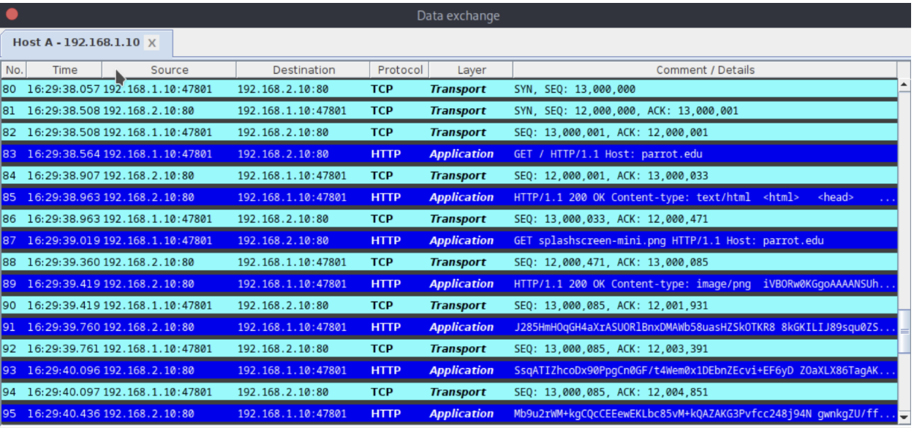
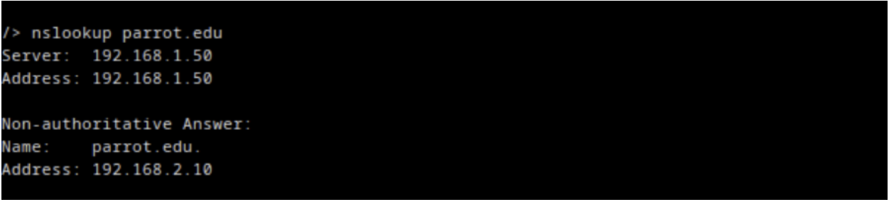
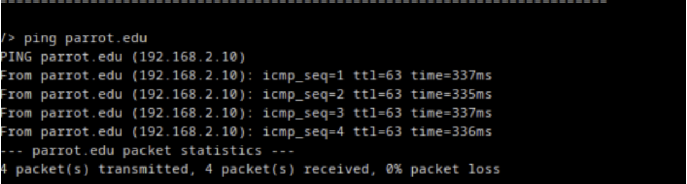
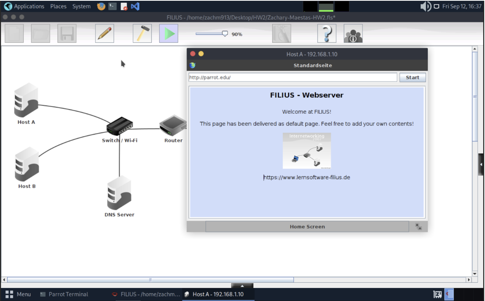

# Homework 3 – DNS, Default Gateway, and Security  
**Course:** CS 456 – Modern Cybersecurity  
**Repo:** modern-cybersecurity/homeworks/hw3  

---

## 📸 Network Lab Screenshots
- **Data exchange capture (HTTP + TCP):**   
- **nslookup query for parrot.edu:**   
- **Ping results to parrot.edu:**   
- **Web server response:**   

---

## 🧩 Concepts and Explanations  

### 🔹 DNS Poisoning (Security)
- The DNS server (`192.168.1.50`) acts as the *trusted phonebook* for the network.  
- If an attacker compromises this server, they could **alter the ‘A’ record for `parrot.edu`**, redirecting traffic to a malicious IP.  
- When Host A queries the poisoned DNS server, it would unknowingly receive the attacker’s IP.  
- The attacker could then:
  - Serve a **phishing webpage** that looks identical to the real site.  
  - Deliver **malware** to Host A.  
  - Perform a **man-in-the-middle (MITM) attack** by intercepting communications.  

This highlights the importance of securing DNS infrastructure, since it directly influences trust in host-to-IP resolution.  

---

### 🔹 Role of the Default Gateway
- In step 3, we updated the **DNS Server setting** on Host A and Host B so they could query `192.168.1.50` for name resolution.  
- However, it was also critical to configure a **Default Gateway on the DNS Server itself**:  
  - The default gateway tells the server how to reach destinations **outside its own subnet**.  
  - DNS lookups often involve resolving hosts beyond the local network.  
  - Without a gateway, the DNS server would be **“trapped”** in Network 1, unable to forward queries or provide correct results for external hosts.  

Even though this assignment only tested local communication, setting the gateway ensures the DNS server could function correctly in real-world scenarios.  

---

## ✅ Summary
- **DNS poisoning** allows attackers to manipulate domain-to-IP mappings, enabling phishing, malware distribution, or MITM attacks.  
- The **default gateway** is necessary on all hosts—including DNS servers—so they can reach other networks when required.  
- This lab reinforced how seemingly small misconfigurations can lead to major vulnerabilities in network communication.  

---

**Author:** Zach Maestas  
CSU – Computer Science (Networks & Security Concentration)  
