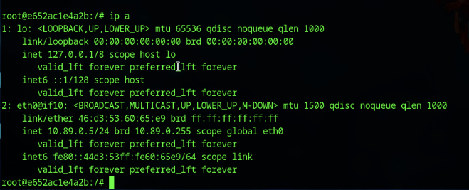
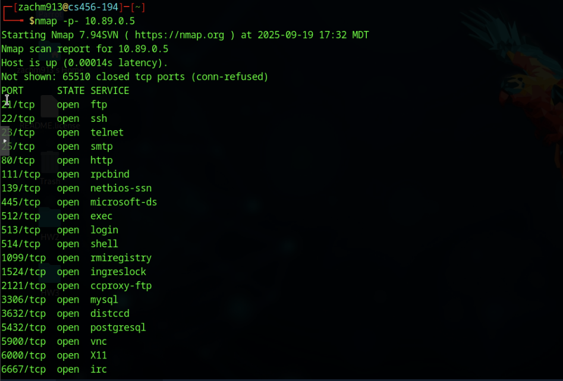
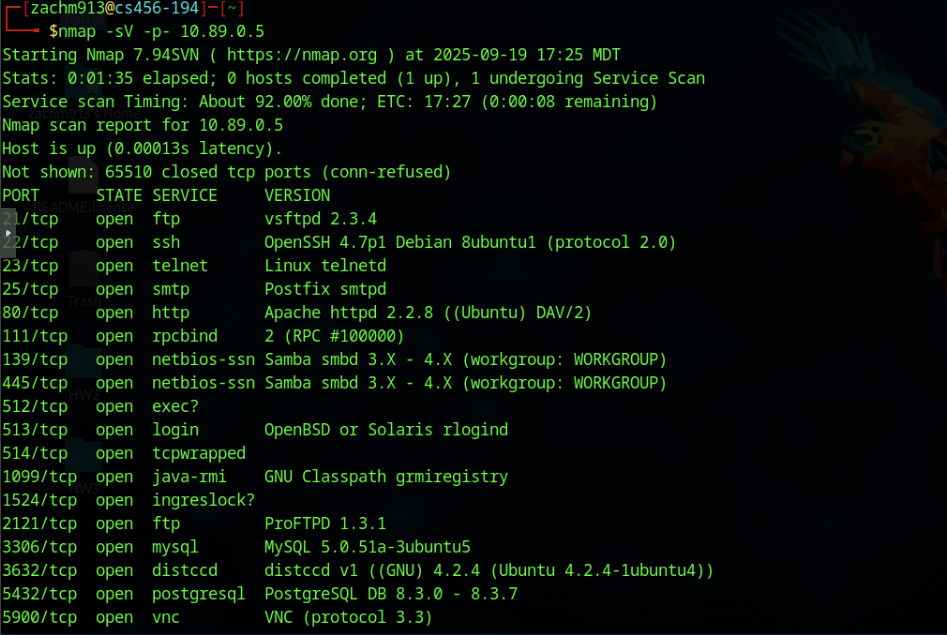
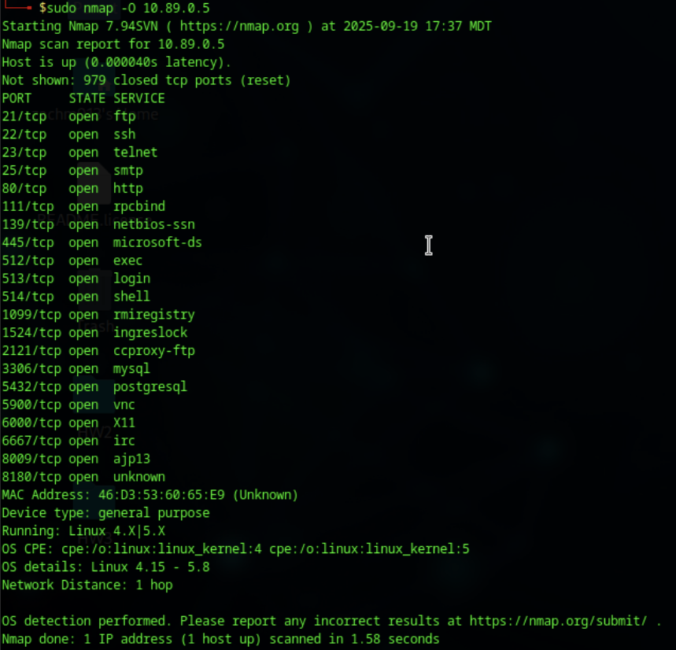
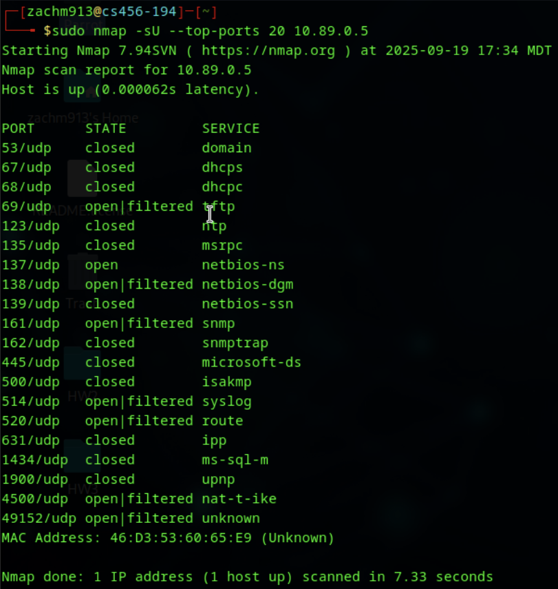

# Homework 4 – Host Discovery & Service Enumeration (Nmap)
**Course:** CS 456 – Modern Cybersecurity  
**Repo path:** `modern-cybersecurity/homeworks/hw4`

---

## 🖼️ Screenshots (embedded)
Interface / `ip a` output:  

Full TCP port scan (`nmap -p-`):  

Service/version detection (`nmap -sV`):  

OS detection (`sudo nmap -O`):  

UDP top-ports scan (`sudo nmap -sU --top-ports 20`):  

---

## 🔎 Analysis Questions & Answers

**How many open TCP ports did your first Nmap scan (`nmap -p- <container_IP>`) discover?**  
**Answer:** 25 open TCP ports.  
**Explanation:** The host is intentionally vulnerable (Metasploitable2-style), so it exposes many services for enumeration and exploitation practice.

**From your service version scan (`-sV`), what is the exact version of the FTP service running on port 21?**  
**Answer:** vsftpd 2.3.4

**What service and version did Nmap identify as running on TCP port 80?**  
**Answer:** Apache httpd 2.2.8 ((Ubuntu) DAV/2)

**According to the OS detection scan (`-O`), what Linux kernel version does Nmap believe the target is running?**  
**Answer:** Linux kernel 4.15 – 5.8 (Nmap reports a range based on fingerprint similarity)

**Using info from one of the previous scans, what Linux distribution does Nmap indicate Metasploitable2 is based on?**  
**Answer:** Ubuntu — inferred from service banners and version strings in the `-sV` output.

**List at least one UDP port that was found to be open or `open|filtered`. What service did Nmap associate with it?**  
**Answer:** 137/udp — netbios-ns (reported as open / open|filtered in the UDP scan)

**Identify one service that seems particularly old. Why might an old service version be a security risk? Find the latest version of this service.**

- **Identified service:** Apache httpd 2.2.8 (port 80)

- **Why risky:** Older services often contain well-documented vulnerabilities that are no longer patched; attackers can exploit known CVEs or publicly available exploit code. Running deprecated versions greatly increases attack surface.

- **Latest branch (upstream):** The Apache HTTP Server project maintains the 2.4.x branch as the modern stable series (see https://httpd.apache.org/ for exact current releases).

---

## ✅ Key Takeaways

- **Large attack surface:** 25 open TCP ports indicates many exposed services; reduce unnecessary services in production.  
- **Version enumeration matters:** `nmap -sV` provides versions that you can map to CVEs—use this responsibly in labs.  
- **OS detection is indicative:** `-O` narrows down kernels/OS families but can be imprecise—treat results as leads, not certainties.  
- **UDP results are noisy:** UDP scans often return `open|filtered` due to the protocol’s connectionless nature—interpret with caution.  
- **Patch & harden:** Outdated services (e.g., Apache 2.2.8) demonstrate why patching, minimal service exposure, and proper configuration are essential defenses.

---

## Notes

- Only perform `nmap` and other vulnerability scans on systems you own or have explicit authorization to test. Unauthorized scanning may be illegal or violate acceptable-use policies.  
- This target is intentionally insecure for educational purposes (do not use these techniques on production systems).  
- Always validate `nmap` findings with additional reconnaissance and cross-reference with trusted vulnerability databases before drawing final conclusions.

---

## Author

**Zach Maestas**  
CSU – Computer Science (Networks & Security Concentration)
